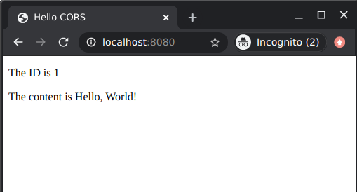
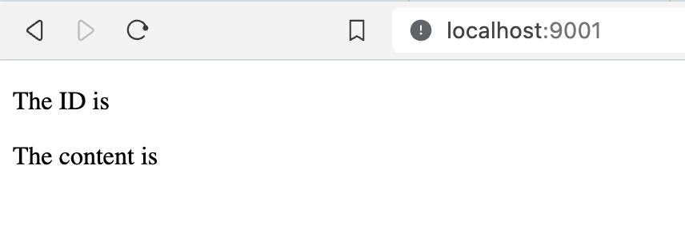

:spring_version: current
:jackson: http://wiki.fasterxml.com/JacksonHome
:Controller: http://docs.spring.io/spring/docs/{spring_version}/javadoc-api/org/springframework/stereotype/Controller.html
:DispatcherServlet: http://docs.spring.io/spring/docs/{spring_version}/javadoc-api/org/springframework/web/servlet/DispatcherServlet.html
:SpringApplication: http://docs.spring.io/spring-boot/docs/{spring_boot_version}/api/org/springframework/boot/SpringApplication.html
:ResponseBody: http://docs.spring.io/spring/docs/{spring_version}/javadoc-api/org/springframework/web/bind/annotation/ResponseBody.html
:MappingJackson2HttpMessageConverter: http://docs.spring.io/spring/docs/{spring_version}/javadoc-api/org/springframework/http/converter/json/MappingJackson2HttpMessageConverter.html
:gs-rest-service: link:/guides/gs/rest-service/
:gs-consuming-rest-jquery: link:/guides/gs/consuming-rest-jquery/
:gs-spring-boot: link:/guides/gs/spring-boot/
:toc:
:icons: font
:source-highlighter: prettify
:project_id: gs-rest-service-cors
:spring_version: current
:spring_boot_version: 1.3.3.RELEASE
This guide walks you through the process of creating a "hello world" link:/understanding/REST[RESTful web service] with Spring that includes headers for link:/understanding/CORS[Cross-Origin Resource Sharing (CORS)] in the response.

== What you'll build

You'll build a service that will accept HTTP GET requests at:

    http://localhost:8080/greeting

and respond with a link:/understanding/JSON[JSON] representation of a greeting:

[source,json]
----
{"id":1,"content":"Hello, World!"}
----

You can customize the greeting with an optional `name` parameter in the query string:

    http://localhost:8080/greeting?name=User

The `name` parameter value overrides the default value of "World" and is reflected in the response:

[source,json]
----
{"id":1,"content":"Hello, User!"}
----

This service differs slightly from the one described in {gs-rest-service}[Building a RESTful Web Service] in that it will
use Spring Framework CORS support to add the relevant CORS response headers.

== What you'll need

:java_version: 1.8
include::https://raw.githubusercontent.com/spring-guides/getting-started-macros/master/prereq_editor_jdk_buildtools.adoc[]

include::https://raw.githubusercontent.com/spring-guides/getting-started-macros/master/how_to_complete_this_guide.adoc[]

include::https://raw.githubusercontent.com/spring-guides/getting-started-macros/master/hide-show-gradle.adoc[]

include::https://raw.githubusercontent.com/spring-guides/getting-started-macros/master/hide-show-maven.adoc[]

include::https://raw.githubusercontent.com/spring-guides/getting-started-macros/master/hide-show-sts.adoc[]

[[initial]]
== Create a resource representation class

Now that you've set up the project and build system, you can create your web service.

Begin the process by thinking about service interactions.

The service will handle `GET` requests for `/greeting`, optionally with a `name` parameter in the query string. The `GET` request should return a `200 OK` response with JSON in the body that represents a greeting. It should look something like this:

[source,json]
----
{
    "id": 1,
    "content": "Hello, World!"
}
----

The `id` field is a unique identifier for the greeting, and `content` is the textual representation of the greeting.

To model the greeting representation, you create a resource representation class. Provide a plain old java object with fields, constructors, and accessors for the `id` and `content` data:

`src/main/java/hello/Greeting.java`
[source,java]
----
include::complete/src/main/java/hello/Greeting.java[]
----

NOTE: As you see in steps below, Spring uses the {jackson}[Jackson JSON] library to automatically marshal instances of type `Greeting` into JSON.

Next you create the resource controller that will serve these greetings.

== Create a resource controller

In Spring's approach to building RESTful web services, HTTP requests are handled by a controller. These components are easily identified by the {Controller}[`@Controller`] annotation, and the `GreetingController` below handles `GET` requests for `/greeting` by returning a new instance of the `Greeting` class:

`src/main/java/hello/GreetingController.java`
[source,java]
----
include::complete/src/main/java/hello/GreetingController.java[lines=1..16;18..22;29..30]
----

This controller is concise and simple, but there's plenty going on under the hood. Let's break it down step by step.

The `@RequestMapping` annotation ensures that HTTP requests to `/greeting` are mapped to the `greeting()` method.

NOTE: The above example does not specify `GET` vs. `PUT`, `POST`, and so forth, because `@RequestMapping` maps all HTTP operations by default. Use `@RequestMapping(method=GET)` to narrow this mapping.

`@RequestParam` binds the value of the query string parameter `name` into the `name` parameter of the `greeting()` method. This query string parameter is not `required`; if it is absent in the request, the `defaultValue` of "World" is used.

The implementation of the method body creates and returns a new `Greeting` object with `id` and `content` attributes based on the next value from the `counter`, and formats the given `name` by using the greeting `template`.

A key difference between a traditional MVC controller and the RESTful web service controller above is the way that the HTTP response body is created. Rather than relying on a link:/understanding/view-templates[view technology] to perform server-side rendering of the greeting data to HTML, this RESTful web service controller simply populates and returns a `Greeting` object. The object data will be written directly to the HTTP response as JSON.

To accomplish this, the {ResponseBody}[`@ResponseBody`] annotation on the `greeting()` method tells Spring MVC that it does not need to render the greeting object through a server-side view layer, but that instead that the greeting object returned _is_ the response body, and should be written out directly.

The `Greeting` object must be converted to JSON. Thanks to Spring's HTTP message converter support, you don't need to do this conversion manually. Because {jackson}[Jackson] is on the classpath, Spring's {MappingJackson2HttpMessageConverter}[`MappingJackson2HttpMessageConverter`] is automatically chosen to convert the `Greeting` instance to JSON.

== Enabling CORS

=== Controller method CORS configuration

So that the RESTful web service will include CORS access control headers in its response, you just have to add a `@CrossOrigin` annotation to the handler method:

`src/main/java/hello/GreetingController.java`
[source,java]
----
include::complete/src/main/java/hello/GreetingController.java[lines=17..22]
----

This `@CrossOrigin` annotation enables cross-origin requests only for this specific method. By default, its allows all origins, all headers, the HTTP methods specified in the `@RequestMapping` annotation and a maxAge of 30 minutes is used. You can customize this behavior by specifying the value of one of the annotation attributes: `origins`, `methods`, `allowedHeaders`, `exposedHeaders`, `allowCredentials` or `maxAge`. In this example, we only allow `http://localhost:8080` to send cross-origin requests.

NOTE: it is also possible to add this annotation at controller class level as well, in order to enable CORS on all handler methods of this class.

=== Global CORS configuration

As an alternative to fine-grained annotation-based configuration, you can also define some global CORS configuration as well. This is similar to using a `Filter` based solution, but can be declared within Spring MVC and combined with fine-grained `@CrossOrigin` configuration. By default all origins and `GET`, `HEAD` and `POST` methods are allowed.

`src/main/java/hello/GreetingController.java`
[source,java]
----
include::complete/src/main/java/hello/GreetingController.java[lines=24..28]
----

`src/main/java/hello/Application.java`
[source,java]
----
include::complete/src/main/java/hello/Application.java[lines=17..25]
----

You can easily change any properties (like the `allowedOrigins` one in the example), as well as only apply this CORS configuration to a specific path pattern.
Global and controller level CORS configurations can also be combined.

== Make the application executable

Although it is possible to package this service as a traditional link:/understanding/WAR[WAR] file for deployment to an external application server, the simpler approach demonstrated below creates a standalone application. You package everything in a single, executable JAR file, driven by a good old Java `main()` method. Along the way, you use Spring's support for embedding the link:/understanding/Tomcat[Tomcat] servlet container as the HTTP runtime, instead of deploying to an external instance.

`src/main/java/hello/Application.java`
[source,java]
----
include::complete/src/main/java/hello/Application.java[lines=1..15;26..27]
----

`@SpringBootApplication` is a convenience annotation that adds all of the following:
    
- `@Configuration` tags the class as a source of bean definitions for the application context.
- `@EnableAutoConfiguration` tells Spring Boot to start adding beans based on classpath settings, other beans, and various property settings.
- Normally you would add `@EnableWebMvc` for a Spring MVC app, but Spring Boot adds it automatically when it sees **spring-webmvc** on the classpath. This flags the application as a web application and activates key behaviors such as setting up a `DispatcherServlet`.
- `@ComponentScan` tells Spring to look for other components, configurations, and services in the the `hello` package, allowing it to find the `HelloController`.

The `main()` method uses Spring Boot's `SpringApplication.run()` method to launch an application. Did you notice that there wasn't a single line of XML? No **web.xml** file either. This web application is 100% pure Java and you didn't have to deal with configuring any plumbing or infrastructure.

include::https://raw.githubusercontent.com/spring-guides/getting-started-macros/master/build_an_executable_jar_subhead.adoc[]

include::https://raw.githubusercontent.com/spring-guides/getting-started-macros/master/build_an_executable_jar_with_both.adoc[]

Logging output is displayed. The service should be up and running within a few seconds.

== Test the service

Now that the service is up, visit http://localhost:8080/greeting, where you see:

[source,json]
----
{"id":1,"content":"Hello, World!"}
----

Provide a `name` query string parameter with http://localhost:8080/greeting?name=User. Notice how the value of the `content` attribute changes from "Hello, World!" to "Hello User!":

[source,json]
----
{"id":2,"content":"Hello, User!"}
----

This change demonstrates that the `@RequestParam` arrangement in `GreetingController` is working as expected. The `name` parameter has been given a default value of "World", but can always be explicitly overridden through the query string.

Notice also how the `id` attribute has changed from `1` to `2`. This proves that you are working against the same `GreetingController` instance across multiple requests, and that its `counter` field is being incremented on each call as expected.

Now to test that the CORS headers are in place and allowing a Javascript client from another origin to access the service, you'll need to create a Javascript client to consume the service.

First, create a simple Javascript file named `hello.js` with the following content:

`public/hello.js`
[source,js]
----
include::complete/public/hello.js[]
----

This script uses jQuery to consume the REST service at http://localhost:8080/greeting.
It is loaded by `index.html` as shown here:

`public/index.html`
[source,html]
----
include::complete/public/index.html[]
----

NOTE: This is essentially the REST client created in {gs-consuming-rest-jquery}[Consuming a RESTful Web Service with jQuery], modified slightly to consume the service running on localhost, port 8080. See that guide for more details on how this client was developed.

Because the REST service is already running on localhost, port 8080, you'll need to be sure to start the client from another server and/or port.
This will not only avoid a collision between the two applications, but will also ensure that the client code is served from a different origin than the service.
To start the client running on localhost, port 9000:

----
mvn spring-boot:run -Dserver.port=9000
----

Once the client starts, open http://localhost:9000 in your browser, where you should see:

If the service response includes the CORS headers, then the ID and content will be rendered into the page. But if the CORS headers are missing (or insufficiently defined for the client), then the browser will fail the request and the values will not be rendered into the DOM:

== Summary

Congratulations! You've just developed a RESTful web service including Cross-Origin Resource Sharing with Spring. 

include::https://raw.githubusercontent.com/spring-guides/getting-started-macros/master/footer.adoc[]

